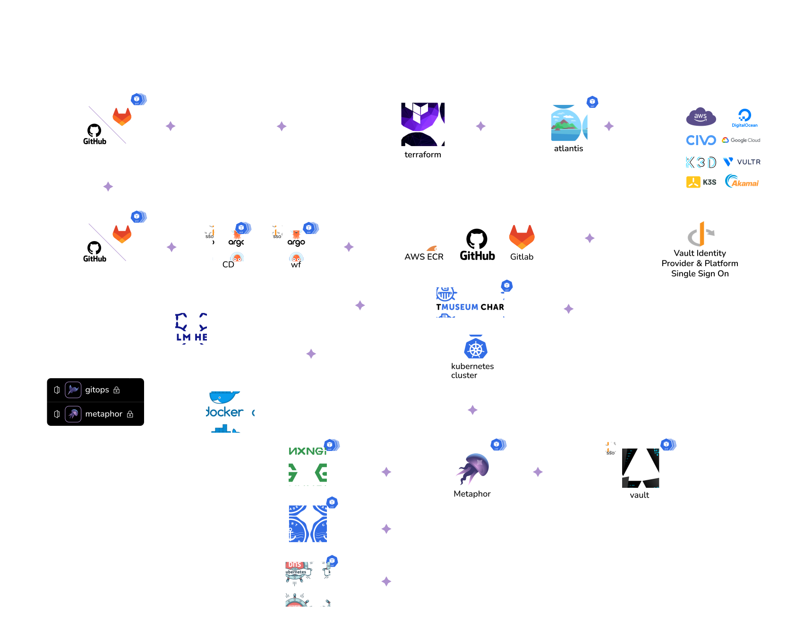

# Kubefirst Documentation

Welcome to the open source repository for [the Kubefirst and Kubefirst Pro documentation](https://kubefirst-pro.konstruct.io/docs/).

- If you're new to Kubefirst check out the [Overview Page](https://kubefirst-pro.konstruct.io/docs/overview/feature) to learn more.

## Contributing

We welcome fixes and improvements to our documentation. Our contribution guidelines are available at [CONTRIBUTING.md](./CONTRIBUTING.md).

<!-- markdownlint-disable MD041 -->
  

    <picture>
      <source media="(prefers-color-scheme: light)" srcset="docs/img/general/architecture-light.svg" alt="Kubefirst Architecture"/>
      
    </picture>
  

<!-- markdownlint-enabled MD041 -->
