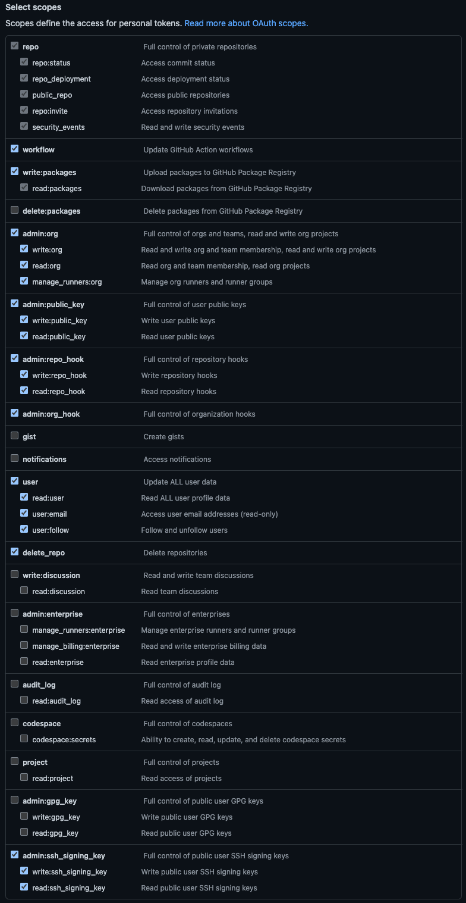
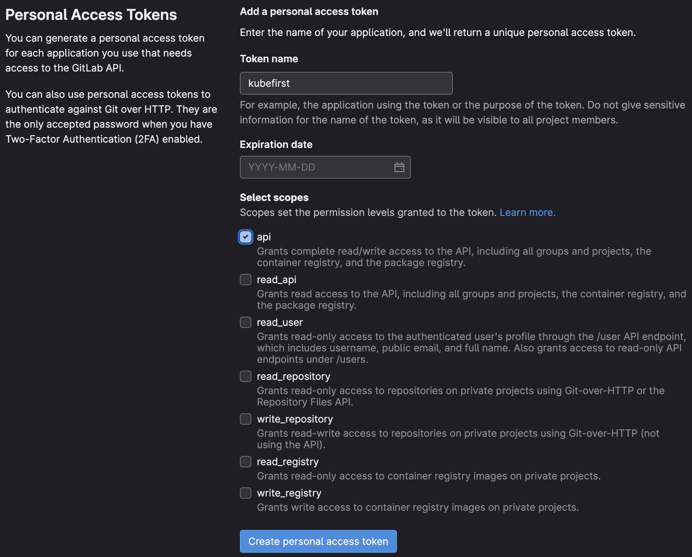

## Summary

Kubefirst expects you to create a dedicated GitHub or GitLab account to be the Kubefirst service account, and requires a Personal Access Token to authenticate with the
respective API. The token is used to manage git repository configurations and teams, and is stored as your source of truth in your self-hosted Vault instance.
Refer to the details below to create a token for your preferred git provider.

## GitHub Tokens

Log in to your GitHub account and issue a Personal Access token using the [list of scopes below](#github-token-scopes). With the manually generated token, provide it via environment variable using `export GITHUB_TOKEN=ghp_xxxxxxxxxxxxxxxx`.

:::tip
If you have never connected to GitHub using SSH be sure to add your token to the known host using the command `ssh-keyscan github.com >> ~/.ssh/known_hosts`. This step prevents ssh errors.

If you get either the  `ssh: handshake failed: knownhosts: key is unknown` error or the `known_hosts file does not exist` error when running the previous command, it's because you are missing an  `~/.ssh` folder, run `mkdir ~/.ssh` and try the `ssh-keyscan` command again.
:::

### GitHub Token Scopes

Kubefirst needs the following scopes or scopes groups:

<!-- vale off -->
| Scope                 | Score Permission                             | Kubefirst Usage                                                                                         |
|-----------------------|----------------------------------------------|---------------------------------------------------------------------------------------------------------|
| repo                  | Full access to public & private repositories | Creating 2 repositories on cluster creation & manage repositories related to your cluster with Atlantis |
| workflow              | Add & update GitHub Actions workflow files   | Creating workflows that will help manage your cluster and repositories                                  |
| write:packages        | Upload & publish packages in GitHub Packages | Creating application packages (ex.: metaphor)                                                           |
| admin:org             | Fully manage the organization                | Managing users and accesses with Infrastructure as Code using Atlantis & Vault                          |
| admin:public_key      | Fully manage public keys                     | Needed for the Kubefirst admin kbot user to take action in the repositories we created for you          |
| admin:repo_hook       | Full access to repository hooks              | Creating hooks for Atlantis to subscribe to some GitHub events (i.e., comments, pull requests...)       |
| admin:org_hook        | Full access to organization hooks            | This is will be removed soon (see [#2180](https://github.com/kubefirst/kubefirst/issues/2180))          |
| user                  | Grants read & write access to profile info   | Retrieving the user profile to display in the console UI & let the user validate the used token         |
| delete_repo           | Delete repositories                          | Deleting repositories managed by Infrastructure as Code with Atlantis                                   |
| admin:ssh_signing_key | Full control of public user SSH signing keys | This is will be removed soon (see [#2180](https://github.com/kubefirst/kubefirst/issues/2180))          |
<!-- vale on -->

You can read more about the [scopes in the GitHub documentation](https://docs.github.com/en/apps/oauth-apps/building-oauth-apps/scopes-for-oauth-apps#available-scopes).

:::warning
These scopes and permissions are the minimum requirement for Kubefirst to function properly.

If you have security concerns we recommend creating a new GitHub user or organization for testing Kubefirst.
:::

## GitLab Token

Kubefirst uses a limited number of scopes (what is allowed with the issued token) to provision the Kubefirst platform such as creating GitLab repositories and updating the GitLab repository webhook URL.

Log into your GitLab account and issue a Personal Access Token using the list of scopes below. With the manually generated token, you can provide it via environment variable: `export GITLAB_TOKEN=glpat-xxxxxxxxxxxxxxxx`.

:::tip
If you have never connected to GitLab using SSH be sure to add it to the known host using the command `ssh-keyscan gitlab.com >> ~/.ssh/known_hosts`. This step prevents ssh errors.

If you get either the  `ssh: handshake failed: knownhosts: key is unknown` error or the `known_hosts file does not exist` error when running the previous command, it's because you are missing an  `~/.ssh` folder, run `mkdir ~/.ssh` and try the `ssh-keyscan` command again.

:::

### GitLab Token Scopes

Kubefirst uses the following scopes in GitLab to provision the Kubefirst platform:

:::info
These scopes and permissions are the minimum requirement for Kubefirst to function properly.

If you have security concerns we recommend creating a new GitLab user and Group for testing Kubefirst.
:::
