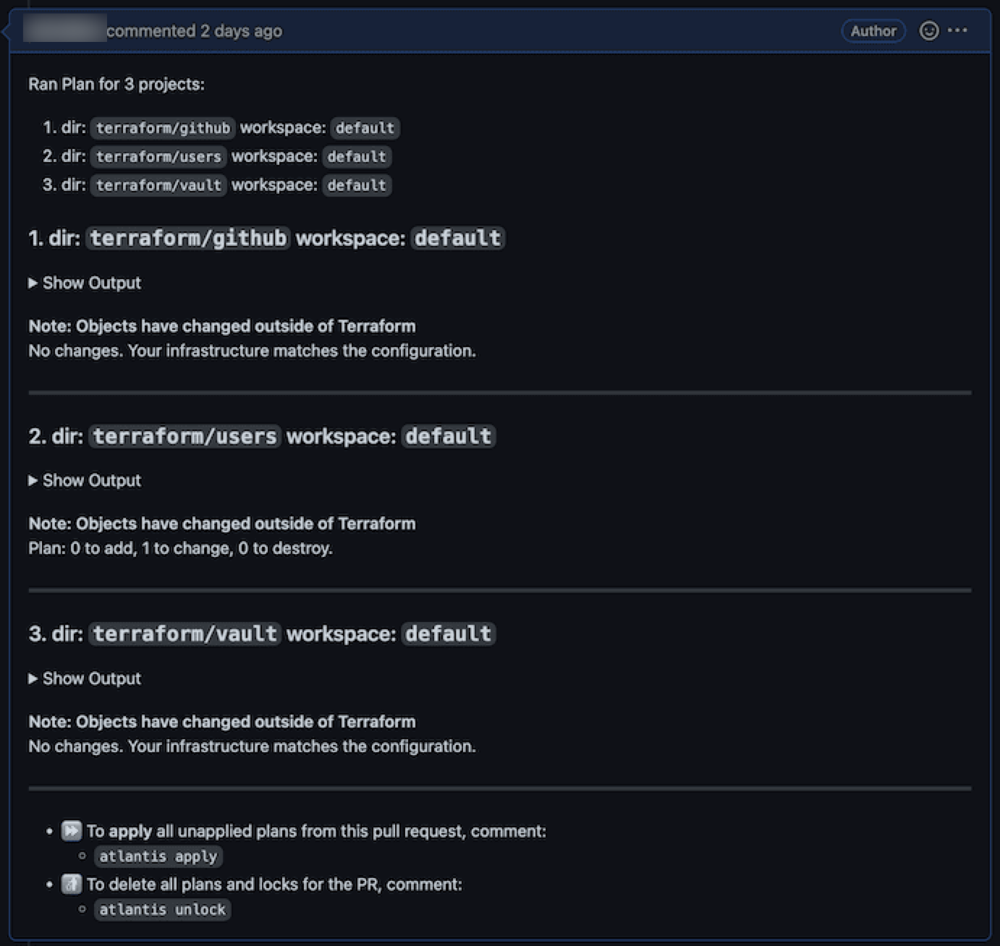
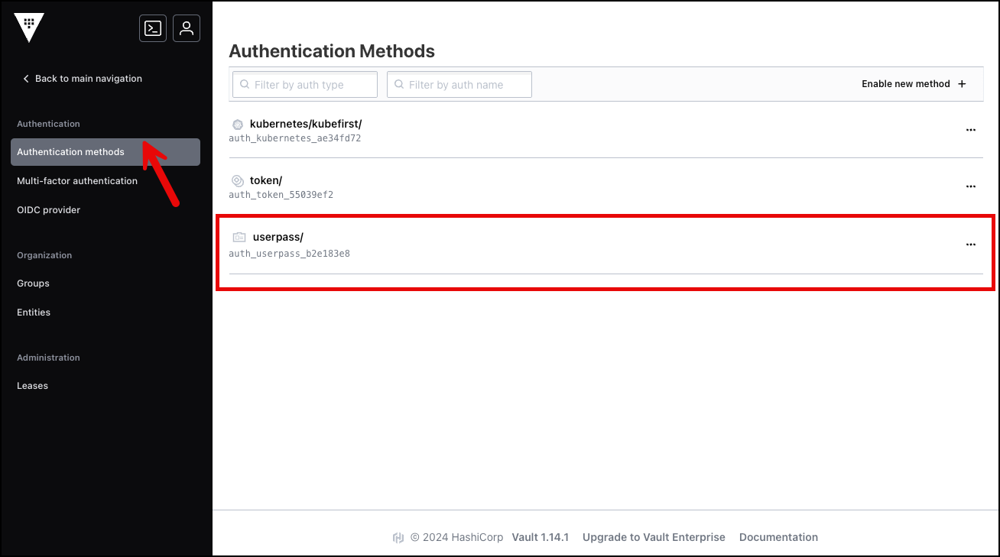

## Summary

Installing Kubefirst for the first time creates a single user account named `kbot` to run all automated platform operations. While you can continue to use this account to access Kubefirst, we recommend creating a human user administrator account to manage privileges and establish best practices around system logging and security.

Kubefirst currently supports two types of user accounts: administrators and developers.

Developers are restricted in their ability to delete applications (Argo CD), access secrets, and reset other user’s passwords.

## Add a New User

These steps walk through the process of creating a new user (for new Kubefirst users this will likely be the first administrator account you create).

### Process Overview

In these instructions you will complete the following steps:

  1. Open the GitOps repository created as part of your Kubefirst installation
  2. Clone this repository and create a new Git branch to make changes
  3. Update the `admin-one.tf` file with your preferred user details (email, name, git username, username, etc)
  4. Add the new module to the list found in `admins-outputs.tf`
  5. Commit these changes on a non-main branch and create a new pull request
  6. Comment on the pull request to trigger Atlantis to apply the new plan
  7. Share the new credentials with the user and provide them with the instructions below to update their password

### Important Process Tips

#### Atlantis

- **Do not** manually merge Terraform pull requests.
- Atlantis automatically runs plans when a pull request is opened that includes changes to the files mapped in `atlantis.yaml`.
- Atlantis merges pull requests automatically once apply is successfully executed.

#### Users and Passwords

- Any users created with this process will have their temporary initial passwords stored in your Vault instance.
  - These passwords are stored 1-time-only and will not be kept in sync with password changes. They are only for onboarding.
- Users' initial passwords are stored in the Vault secret store `/secrets/users/<username>`.
- Access to the users store in Vault is available only with the `root` token login credentials provided to you during your Kubefirst installation.
- Users added through an Infrastructure as Code process automatically propagate to all tools due to the Vault OIDC provider that's preconfigured throughout Kubefirst platform tools.

### Steps to Add a User

1. Navigate to the `gitops` repository created by your Kubefirst installation in your GitHub org or GitLab group and clone the contents.
2. Navigate to the cloned repository and create a new branch.

    ```shell
        cd gitops
        git checkout -b new-user
    ```

3. In the cloned repository, locate the folder `cloud-gitprovider/terraform/users/admins` . It contains two files that for admin users: admin-one.tf (commented-out), and the `kbot` user in  `kbot.tf`.

    ```shell
        module "admin_one" {
        source = "./modules/user/github"

        acl_policies            = ["admin"]
        email                   = "your.admin@your-company.io"
        first_name              = "Admin"
        github_username         = "admin-one-github-username"
        last_name               = "One"
        team_id                 = data.github_team.admins.id
        username                = "aone"
        user_disabled           = false
        userpass_accessor       = data.vault_auth_backend.userpass.accessor
        }
    ```

4. Uncomment the file and edit the code to update the values for: `email`, `first_name`, `github_username`, `last_name`, and `username`.

5. Open `admin.tf` and edit the list of administrators to include your new module. Every admin that is added to the platform will need to have their ID added to this list so that its client id is added to the group in Vault.

    ```shell
    output "vault_identity_entity_ids" {
    value = [
        module.kbot.vault_identity_entity_id,
        module.firstname_lastname.vault_identity_entity_id,
    ]
    }
    ```

6. Commit your changes and create a new pull request to start the Atlantis workflow.

    ```shell
        git add 
        git commit -m feat: add new user
        git push --set-upstream origin new-user
    ```

7. After submitting the pull request, a comment will appear that shows the Terraform plan with the changes to your infrastructure.

    

8. To apply these changes, you or someone in the organization can submit a comment of `atlantis apply` on that pull request to apply the plan.

    :::warning
    Do not manually merge Terraform PRs.

    If your Terraform plan errors, and you need to update your PR, just change your branch and commit and push the change to your branch. The Atlantis plan will regenerate each time your files are updated in the pull request.
    :::

9. After the user is successfully created, navigate to Vault to update the password.
   - For users other than yourself, share the credentials you have created and provide the instructions below.

## Reset your Password

Passwords can be reset by anyone in the administrators group, or by anyone with the Vault root token. These instructions assume that you or someone else (an administrator) has created a username and password for you in Vault.

### Step 1 - Getting your Vault root token

To get your Vault root token you will need to do two things.

1. First, connect to your management cluster. This step varies based on your cloud but for example (with a management cluster with the name `management`):

   - In AWS run `aws eks update-kubeconfig --name management --region us-east-1`

   - In Civo run `civo kubernetes config --region fra1 management --save`

2. Then run  `kubectl -n vault get secrets/vault-unseal-secret --template='{{index .data "root-token"}}' | base64 -d`.

### Step 2 - Resetting the Password

These steps are for the owner of the credentials to reset the password in Vault.

1. Log with the user on Vault: `https://vault.$yourdomain.com/ui/vault/auth?with=userpass`

    - Update the `yourdomain.com` portion of the URL above to reflect your details

2. Navigate to **Access** from the main menu and select **Authentication methods**.
3. Select `userpass` from the list of authentication methods.

    

4. Locate and select your user from the list.
5. Select **Edit user** from the options menu.
6. Update the Password field with a new password and select **Save**.
