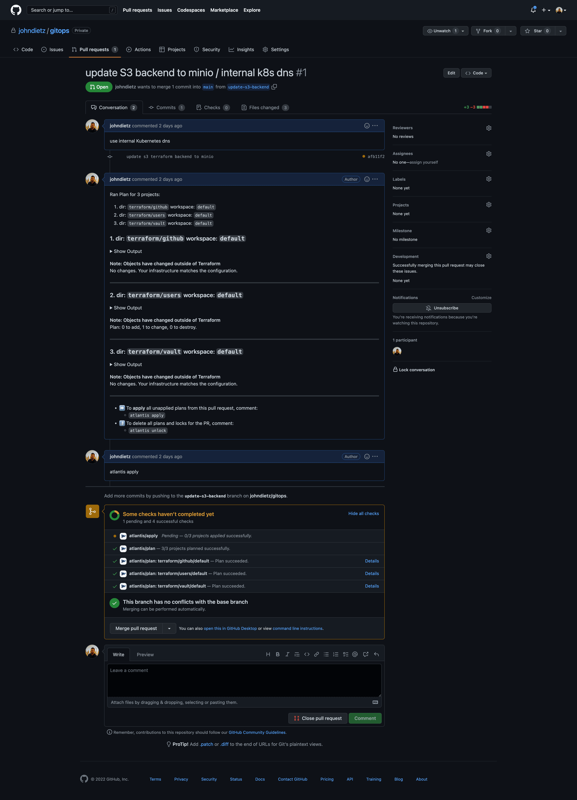
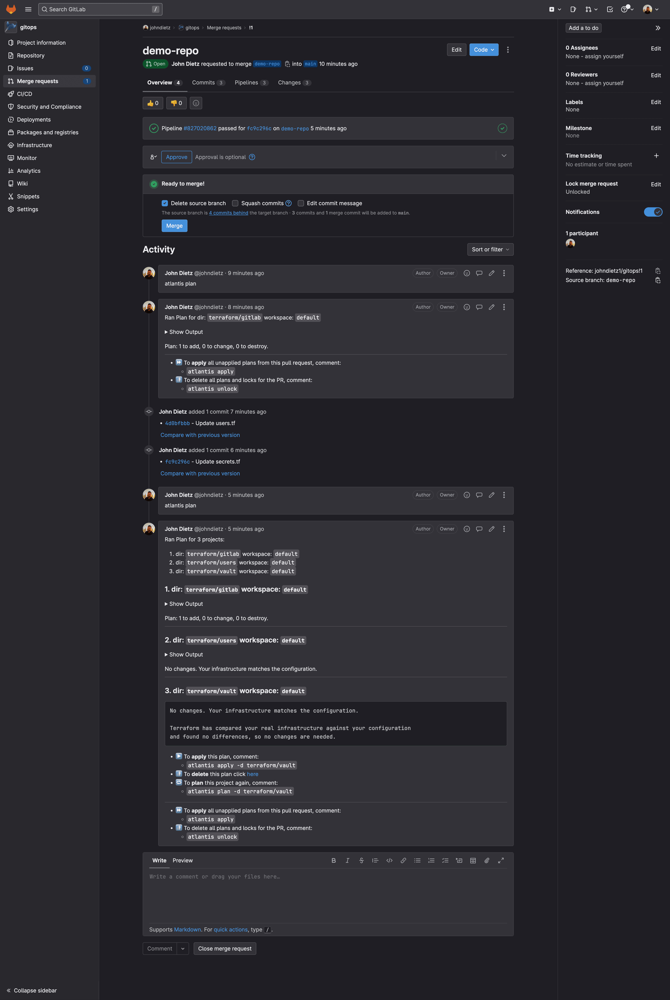

## Summary

When you create a new cluster with Kubefirst, two new repositories are created in your preferred git provider (GitLab or GitHub). Keep reading to learn more about the repositories that are created, what they include, and how to work with them.

## Repositories

### `gitops`

The `gitops` repository contains all of our Infrastructure as Code (IaC) and all of our GitOps configurations. All of the infrastructure that you receive when you provision Kubefirst is produced by some combination of [Terraform and Argo CD](../features/terraform.md). You can modify, update, or add to this `gitops` repository based on your business needs: it belongs to you!

:::caution
Your new `gitops` repository doesn't have any branch protection by default. We strongly recommend adding `main` branch protection once you onboard your second administrator.

Read more on setting this up [in GitHub here](https://docs.github.com/en/repositories/configuring-branches-and-merges-in-your-repository/managing-protected-branches) or [in GitLab here.](https://docs.gitlab.com/ee/user/project/repository/branches/protected.html)
:::

### `metaphor`

The Metaphor repository is an example application with source code, builds, and GitOps delivery to showcase various features, integrations, and best practices in the Kubefirst platform. Check out [more on Metaphor here.](../features/metaphor/)

## Repository Management

Both GitHub and GitLab repositories are managed in Terraform.

For additional **GitHub repositories**, just add a new section of Terraform code to `terraform/github/repos.tf`:

```terraform
# set auto_init to false if importing an existing repository
# true if it's a new repository

module "your_repo_name" {
  source = "./modules/repository"
  visibility         = "private"
  repo_name          = "your-repo-name"
  archive_on_destroy = true
  auto_init          = false
}
```

For additional **GitLab repositories**, just add a new section of Terraform code to `terraform/gitlab/kubefirst-repos.tf`.

```terraform
module "your_repo_name" {
  depends_on = [
    gitlab_group.kubefirst
  ]
  source                                = "./templates/gitlab-repo"
  group_name                            = gitlab_group.kubefirst.id
  repo_name                             = "your-repo-name"
  create_ecr                            = true
  initialize_with_readme                = true
  only_allow_merge_if_pipeline_succeeds = false
  remove_source_branch_after_merge      = true
}
```

Both GitHub and GitLab’s Terraform providers offer many configuration options in addition to  these settings. You can check them out and add to your default settings once you're comfortable with the platform.
    - Review the `Resources` section of the [GitHub provider documentation](https://registry.terraform.io/providers/integrations/github/latest/docs).
    - Review the `Resources` section of the [GitLab provider documentation](https://registry.terraform.io/providers/gitlabhq/gitlab/latest/docs/resources).
    - There are a ton of Terraform providers available and [the list of technologies you can manage](https://www.terraform.io/docs/providers/index.html) in Terraform are really impressive.

## Making Terraform Changes

To make infrastructure and configuration changes with Terraform, simply open a pull request against any of the Terraform directory folders in the `gitops` repository.

Your pull request automatically provides plans, state locks, and applies. You can also comment on the merge request itself. You'll have a simple, peer- reviewable, auditable changelog of all infrastructure and configuration changes.

To learn more about how Kubefirst uses Terraform take a look at [our documentation Terraform and Atlantis.](../features/terraform.md)

## Atlantis Examples

### GitHub Atlantis



### GitLab Atlantis


