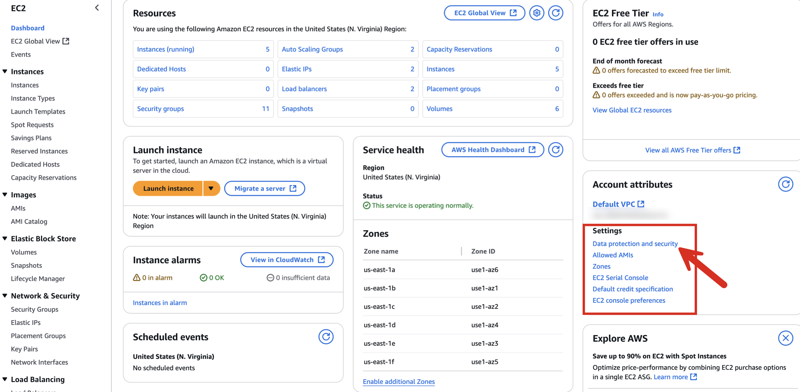
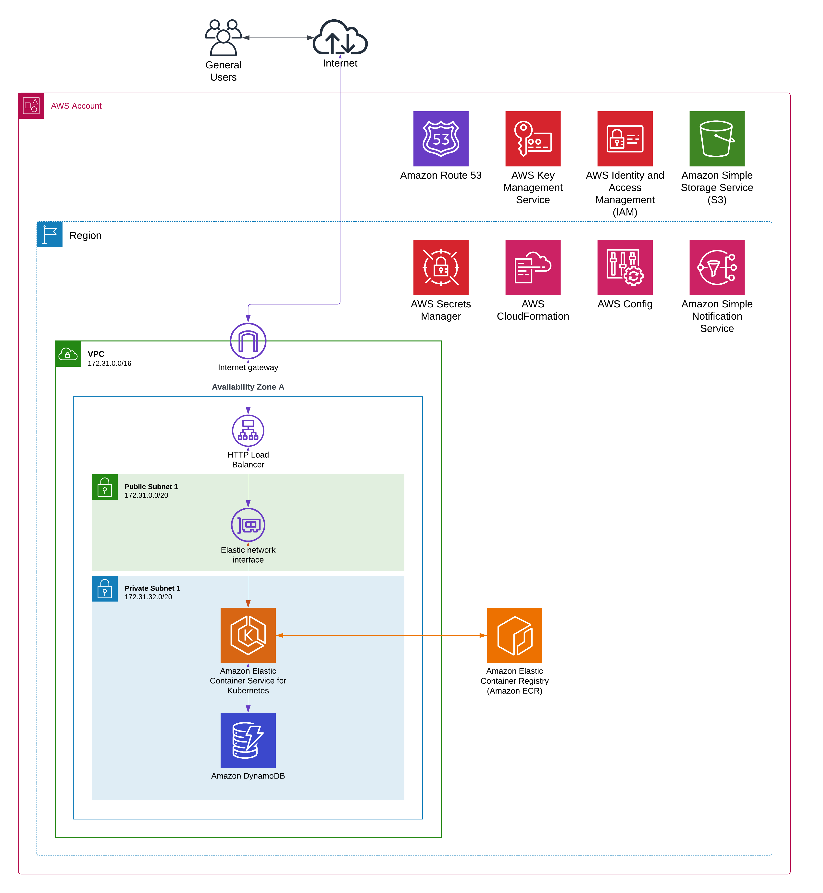

## Summary

This content provides details on encryption, shows the overall architecture of a Kubefirst Pro deployment, and provides an exhaustive list of Terraform objects created as part of a Kubefirst installation.

## Default Encryption At Rest

When using Kubefirst Pro to enable encryption at rest throughout your AWS region for EC2 you will need to complete the following steps:

1. Open the [Amazon EC2 console](https://console.aws.amazon.com/ec2/) and select your Region.
2. Select the EC2 Dashboard. Under Account Attributes select **Data protection and security**.

    

3. In the EBS encryption section, choose Manage. Select Enable. You keep the AWS managed key with the alias aws/ebs created on your behalf as the default encryption key, or choose a symmetric customer managed encryption key.

4. Choose Update EBS encryption.

Refer to additional details [in the AWS documentation.](https://docs.aws.amazon.com/ebs/latest/userguide/encryption-by-default.html)

## Diagram



## Terraform Objects

```text
terraform state list
aws_iam_role_policy_attachment.vcluster_external_dns
module.dynamodb.aws_appautoscaling_policy.dynamodb-table-read-policy
module.dynamodb.aws_appautoscaling_policy.dynamodb_table_write_policy
module.dynamodb.aws_appautoscaling_target.dynamodb-table-read-target
module.dynamodb.aws_appautoscaling_target.dynamodb-table-write-target
module.dynamodb.aws_dynamodb_table.vault_dynamodb_table
module.eks.data.aws_availability_zones.available
module.eks.data.aws_caller_identity.current
module.eks.data.aws_iam_policy_document.crossplane_custom_trust_policy
module.eks.aws_iam_policy.aws_ebs_csi_driver
module.eks.aws_iam_policy.cert_manager
module.eks.aws_iam_policy.cluster_autoscaler
module.eks.aws_iam_policy.external_dns
module.eks.aws_iam_policy.vault_dynamodb
module.eks.aws_iam_policy.vault_kms
module.eks.aws_iam_policy.vault_server
module.kms.aws_kms_alias.vault_unseal
module.kms.aws_kms_key.vault_unseal
module.eks.module.argo_workflows.data.aws_caller_identity.current
module.eks.module.argo_workflows.data.aws_iam_policy_document.this[0]
module.eks.module.argo_workflows.data.aws_partition.current
module.eks.module.argo_workflows.data.aws_region.current
module.eks.module.argo_workflows.aws_iam_role.this[0]
module.eks.module.argo_workflows.aws_iam_role_policy_attachment.this["admin"]
module.eks.module.argocd.data.aws_caller_identity.current
module.eks.module.argocd.data.aws_iam_policy_document.this[0]
module.eks.module.argocd.data.aws_partition.current
module.eks.module.argocd.data.aws_region.current
module.eks.module.argocd.aws_iam_role.this[0]
module.eks.module.argocd.aws_iam_role_policy_attachment.this["argocd"]
module.eks.module.atlantis.data.aws_caller_identity.current
module.eks.module.atlantis.data.aws_iam_policy_document.this[0]
module.eks.module.atlantis.data.aws_partition.current
module.eks.module.atlantis.data.aws_region.current
module.eks.module.atlantis.aws_iam_role.this[0]
module.eks.module.atlantis.aws_iam_role_policy_attachment.this["atlantis"]
module.eks.module.aws_ebs_csi_driver.data.aws_caller_identity.current
module.eks.module.aws_ebs_csi_driver.data.aws_iam_policy_document.this[0]
module.eks.module.aws_ebs_csi_driver.data.aws_partition.current
module.eks.module.aws_ebs_csi_driver.data.aws_region.current
module.eks.module.aws_ebs_csi_driver.aws_iam_role.this[0]
module.eks.module.aws_ebs_csi_driver.aws_iam_role_policy_attachment.this["admin"]
module.eks.module.cert_manager.data.aws_caller_identity.current
module.eks.module.cert_manager.data.aws_iam_policy_document.this[0]
module.eks.module.cert_manager.data.aws_partition.current
module.eks.module.cert_manager.data.aws_region.current
module.eks.module.cert_manager.aws_iam_role.this[0]
module.eks.module.cert_manager.aws_iam_role_policy_attachment.this["cert_manager"]
module.eks.module.chartmuseum.data.aws_caller_identity.current
module.eks.module.chartmuseum.data.aws_iam_policy_document.this[0]
module.eks.module.chartmuseum.data.aws_partition.current
module.eks.module.chartmuseum.data.aws_region.current
module.eks.module.chartmuseum.aws_iam_role.this[0]
module.eks.module.chartmuseum.aws_iam_role_policy_attachment.this["chartmuseum"]
module.eks.module.cluster_autoscaler_irsa.data.aws_caller_identity.current
module.eks.module.cluster_autoscaler_irsa.data.aws_iam_policy_document.this[0]
module.eks.module.cluster_autoscaler_irsa.data.aws_partition.current
module.eks.module.cluster_autoscaler_irsa.data.aws_region.current
module.eks.module.cluster_autoscaler_irsa.aws_iam_role.this[0]
module.eks.module.cluster_autoscaler_irsa.aws_iam_role_policy_attachment.this["cluster_autoscalert"]
module.eks.module.crossplane_custom_trust.data.aws_caller_identity.current
module.eks.module.crossplane_custom_trust.data.aws_iam_policy_document.assume_role[0]
module.eks.module.crossplane_custom_trust.data.aws_partition.current
module.eks.module.crossplane_custom_trust.aws_iam_role.this[0]
module.eks.module.crossplane_custom_trust.aws_iam_role_policy_attachment.custom[0]
module.eks.module.ecr_publish_permissions_sync.data.aws_caller_identity.current
module.eks.module.ecr_publish_permissions_sync.data.aws_iam_policy_document.this[0]
module.eks.module.ecr_publish_permissions_sync.data.aws_partition.current
module.eks.module.ecr_publish_permissions_sync.data.aws_region.current
module.eks.module.ecr_publish_permissions_sync.aws_iam_role.this[0]
module.eks.module.ecr_publish_permissions_sync.aws_iam_role_policy_attachment.this["admin"]
module.eks.module.eks.data.aws_caller_identity.current
module.eks.module.eks.data.aws_eks_addon_version.this["aws-ebs-csi-driver"]
module.eks.module.eks.data.aws_eks_addon_version.this["kube-proxy"]
module.eks.module.eks.data.aws_eks_addon_version.this["vpc-cni"]
module.eks.module.eks.data.aws_iam_policy_document.assume_role_policy[0]
module.eks.module.eks.data.aws_iam_session_context.current
module.eks.module.eks.data.aws_partition.current
module.eks.module.eks.data.tls_certificate.this[0]
module.eks.module.eks.aws_cloudwatch_log_group.this[0]
module.eks.module.eks.aws_ec2_tag.cluster_primary_security_group["kubefirst"]
module.eks.module.eks.aws_eks_access_entry.this["argocd_mgmt-275"]
module.eks.module.eks.aws_eks_access_entry.this["atlantis_mgmt-275"]
module.eks.module.eks.aws_eks_access_entry.this["kubernetesadmin"]
module.eks.module.eks.aws_eks_access_policy_association.this["argocd_mgmt-275_view_deployments"]
module.eks.module.eks.aws_eks_access_policy_association.this["atlantis_mgmt-275_view_deployments"]
module.eks.module.eks.aws_eks_access_policy_association.this["kubernetesadmin_view_deployments"]
module.eks.module.eks.aws_eks_addon.before_compute["vpc-cni"]
module.eks.module.eks.aws_eks_addon.this["aws-ebs-csi-driver"]
module.eks.module.eks.aws_eks_addon.this["kube-proxy"]
module.eks.module.eks.aws_eks_cluster.this[0]
module.eks.module.eks.aws_iam_openid_connect_provider.oidc_provider[0]
module.eks.module.eks.aws_iam_policy.cluster_encryption[0]
module.eks.module.eks.aws_iam_role.this[0]
module.eks.module.eks.aws_iam_role_policy_attachment.cluster_encryption[0]
module.eks.module.eks.aws_iam_role_policy_attachment.this["AmazonEKSClusterPolicy"]
module.eks.module.eks.aws_iam_role_policy_attachment.this["AmazonEKSVPCResourceController"]
module.eks.module.eks.aws_security_group.cluster[0]
module.eks.module.eks.aws_security_group.node[0]
module.eks.module.eks.aws_security_group_rule.cluster["ingress_nodes_443"]
module.eks.module.eks.aws_security_group_rule.node["egress_all"]
module.eks.module.eks.aws_security_group_rule.node["ingress_cluster_443"]
module.eks.module.eks.aws_security_group_rule.node["ingress_cluster_4443_webhook"]
module.eks.module.eks.aws_security_group_rule.node["ingress_cluster_6443_webhook"]
module.eks.module.eks.aws_security_group_rule.node["ingress_cluster_8443_webhook"]
module.eks.module.eks.aws_security_group_rule.node["ingress_cluster_9443_webhook"]
module.eks.module.eks.aws_security_group_rule.node["ingress_cluster_kubelet"]
module.eks.module.eks.aws_security_group_rule.node["ingress_nodes_ephemeral"]
module.eks.module.eks.aws_security_group_rule.node["ingress_self_coredns_tcp"]
module.eks.module.eks.aws_security_group_rule.node["ingress_self_coredns_udp"]
module.eks.module.eks.time_sleep.this[0]
module.eks.module.external_dns.data.aws_caller_identity.current
module.eks.module.external_dns.data.aws_iam_policy_document.this[0]
module.eks.module.external_dns.data.aws_partition.current
module.eks.module.external_dns.data.aws_region.current
module.eks.module.external_dns.aws_iam_role.this[0]
module.eks.module.external_dns.aws_iam_role_policy_attachment.this["external_dns"]
module.eks.module.kubefirst_api.data.aws_caller_identity.current
module.eks.module.kubefirst_api.data.aws_iam_policy_document.this[0]
module.eks.module.kubefirst_api.data.aws_partition.current
module.eks.module.kubefirst_api.data.aws_region.current
module.eks.module.kubefirst_api.aws_iam_role.this[0]
module.eks.module.kubefirst_api.aws_iam_role_policy_attachment.this["kubefirst"]
module.eks.module.vault.data.aws_caller_identity.current
module.eks.module.vault.data.aws_iam_policy_document.this[0]
module.eks.module.vault.data.aws_partition.current
module.eks.module.vault.data.aws_region.current
module.eks.module.vault.aws_iam_role.this[0]
module.eks.module.vault.aws_iam_role_policy_attachment.this["dynamo"]
module.eks.module.vault.aws_iam_role_policy_attachment.this["kms"]
module.eks.module.vault.aws_iam_role_policy_attachment.this["vault"]
module.eks.module.vpc.aws_default_network_acl.this[0]
module.eks.module.vpc.aws_default_route_table.default[0]
module.eks.module.vpc.aws_default_security_group.this[0]
module.eks.module.vpc.aws_eip.nat[0]
module.eks.module.vpc.aws_internet_gateway.this[0]
module.eks.module.vpc.aws_nat_gateway.this[0]
module.eks.module.vpc.aws_route.private_nat_gateway[0]
module.eks.module.vpc.aws_route.public_internet_gateway[0]
module.eks.module.vpc.aws_route_table.intra[0]
module.eks.module.vpc.aws_route_table.private[0]
module.eks.module.vpc.aws_route_table.public[0]
module.eks.module.vpc.aws_route_table_association.intra[0]
module.eks.module.vpc.aws_route_table_association.intra[1]
module.eks.module.vpc.aws_route_table_association.intra[2]
module.eks.module.vpc.aws_route_table_association.private[0]
module.eks.module.vpc.aws_route_table_association.private[1]
module.eks.module.vpc.aws_route_table_association.private[2]
module.eks.module.vpc.aws_route_table_association.public[0]
module.eks.module.vpc.aws_route_table_association.public[1]
module.eks.module.vpc.aws_route_table_association.public[2]
module.eks.module.vpc.aws_subnet.intra[0]
module.eks.module.vpc.aws_subnet.intra[1]
module.eks.module.vpc.aws_subnet.intra[2]
module.eks.module.vpc.aws_subnet.private[0]
module.eks.module.vpc.aws_subnet.private[1]
module.eks.module.vpc.aws_subnet.private[2]
module.eks.module.vpc.aws_subnet.public[0]
module.eks.module.vpc.aws_subnet.public[1]
module.eks.module.vpc.aws_subnet.public[2]
module.eks.module.vpc.aws_vpc.this[0]
module.eks.module.vpc_cni_irsa.data.aws_caller_identity.current
module.eks.module.vpc_cni_irsa.data.aws_iam_policy_document.this[0]
module.eks.module.vpc_cni_irsa.data.aws_iam_policy_document.vpc_cni[0]
module.eks.module.vpc_cni_irsa.data.aws_partition.current
module.eks.module.vpc_cni_irsa.data.aws_region.current
module.eks.module.vpc_cni_irsa.aws_iam_policy.vpc_cni[0]
module.eks.module.vpc_cni_irsa.aws_iam_role.this[0]
module.eks.module.vpc_cni_irsa.aws_iam_role_policy_attachment.this["AmazonEKS_CNI_Policy"]
module.eks.module.vpc_cni_irsa.aws_iam_role_policy_attachment.vpc_cni[0]
module.eks.module.eks.module.eks_managed_node_group["default_node_group"].data.aws_caller_identity.current
module.eks.module.eks.module.eks_managed_node_group["default_node_group"].data.aws_iam_policy_document.assume_role_policy[0]
module.eks.module.eks.module.eks_managed_node_group["default_node_group"].data.aws_partition.current
module.eks.module.eks.module.eks_managed_node_group["default_node_group"].aws_eks_node_group.this[0]
module.eks.module.eks.module.eks_managed_node_group["default_node_group"].aws_iam_role.this[0]
module.eks.module.eks.module.eks_managed_node_group["default_node_group"].aws_iam_role_policy_attachment.this["AmazonEC2ContainerRegistryReadOnly"]
module.eks.module.eks.module.eks_managed_node_group["default_node_group"].aws_iam_role_policy_attachment.this["AmazonEKSWorkerNodePolicy"]
module.eks.module.eks.module.eks_managed_node_group["default_node_group"].aws_iam_role_policy_attachment.this["AmazonEKS_CNI_Policy"]
module.eks.module.eks.module.kms.data.aws_caller_identity.current[0]
module.eks.module.eks.module.kms.data.aws_iam_policy_document.this[0]
module.eks.module.eks.module.kms.data.aws_partition.current[0]
module.eks.module.eks.module.kms.aws_kms_alias.this["cluster"]
module.eks.module.eks.module.kms.aws_kms_key.this[0]
module.eks.module.eks.module.eks_managed_node_group["default_node_group"].module.user_data.null_resource.validate_cluster_service_cidr
```
