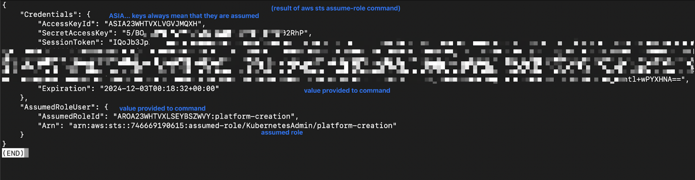

## Summary

After reviewing and confirming you have all of the prerequisites required for this installation process this page walks through the steps for installation
of **Kubefirst for AWS with the Kubefirst CLI**.

### Process Overview

The installation process below includes the following steps:

- Installing a Certificate Authority
- Assuming the KubefirstAdmin Role
- Creating your new Kubefirst cluster
- Using the Kubefirst CLI
- Getting your root credentials

## Install Kubefirst

Refer to the sections below for details on each step of the installation.

### Install the Certificate Authority

We use `mkcert` to generate local certificates and serve `https` with the Traefik Ingress Controller. During the installation, Kubefirst generates these certificates and pushes them to Kubernetes as secrets to attach to Ingress resources.

To allow the applications running in your Kubefirst platform in addition to your browser to trust the certificates generated by your Kubefirst local install, you need to install the CA (Certificate Authority) of mkcert in your trusted store. Run the following command to instal `mkcert`. _(This is not an optional step and cluster creation will fail if you don't install the mkcert CA in your trusted store.)_

```bash
brew install mkcert
mkcert -install
```

For Firefox users, you will also need to install the Network Security Services (NSS). Run the following command.

```bash
brew install nss
```

### Assume the KubernetesAdmin Role

Assume the KubernetesAdmin role that you created in the prerequisites by running the following command, replacing
`111111111111` with your AWS account ID.

```bash
aws sts assume-role --role-arn "arn:aws:iam::111111111111:role/KubernetesAdmin" --role-session-name "kubefirst-platform-creation" --duration-seconds 43200
```

The Kubefirst installer requires you to export these 3 values, including the large session token value.
In this example you can see that the value sometimes ends with `=`. _When copying, be sure to include those, but do not include the `“` as part of the value._



Export these session values to your terminal replacing `xxxx` with your values
from the output of your `aws sts` command.

```bash
export AWS_ACCESS_KEY_ID='xxxx'
export AWS_SECRET_ACCESS_KEY='xxxxxxxx'
export AWS_SESSION_TOKEN='xxxxxxxxxxxxxxxxxxxxxxxxxxxxxxxx'
```

### Create your new Kubefirst cluster

Run the following command for GitHub

```bash
export GITHUB_TOKEN=ghp_xxxxxxxxxxxxxxx

kubefirst aws create \
  --alerts-email yourdistro@your-company.io \
  --domain-name your-company.io \
  --cluster-name kubefirst-mgmt \
  --github-org your-github-organization-name
```

Run the following command for GitLab

```bash
export GITLAB_TOKEN=glpat-xxxxxxxxxxxxxxx

kubefirst aws create \
  --alerts-email yourdistro@your-company.io \
  --git-provider gitlab \
  --gitlab-group your-gitlab-group \
  --domain-name your-domain.io \
  --cluster-name kubefirst
```

### Using the Kubefirst CLI

The `kubefirst aws create` command takes about 35 minutes to complete.
This is the time typically required for cloud resources to create, applications to install,
DNS to propagate, and certificates to resolve.

In a second terminal run the `kubefirst logs` command to view execution details. This is helpful if you run into an error and you would like more details.

If you encounter any errors, refer to the guidance provided by the CLI.

The CLI also attempts to be idempotent, so resolving an issue in your setup is often followed with executing your `kubefirst aws create ...` command again so
that it can complete the platform provision and provide you with the credentials to your new platform.

## What's Next?

### Get your kbot password

Once your platform has provisioned, run the following command to get the password to `kbot`, your initial kubefirst platform system administrator.

```shell
kubefirst aws root-credentials
```

### Local resources

During provisioning `kubefirst` produces a temporary directory of utilities and platform state content located in the `~/.kubefirst` file and the `~/.k1` folders on your
local machine.

These files can be removed with `kubefirst reset` once your platform is provisioned and healthy.

### Explore Kubefirst

Now that you have a functional install you may want to:

- Explore more details on [Kubefirst Features](../../../features/)
- Read details on how to upgrade or manage users and passwords in [Kubefirst Administration](../../../admin/)
- Reach out to [us on Slack](https://konstructio.slack.com) to chat or ask questions
