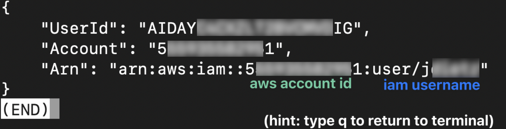
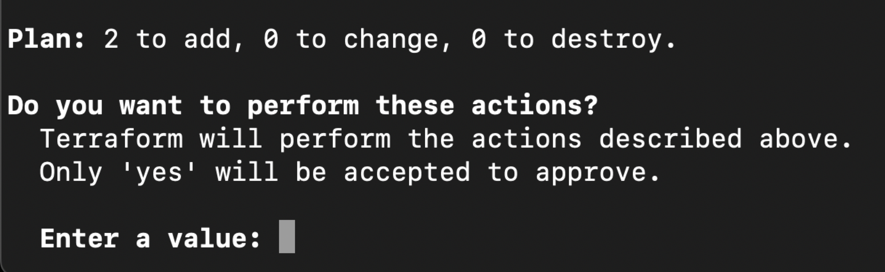

## Summary

This document walks through the prerequisites for installing **Kubefirst using AWS with the Kubefirst CLI**.

## Install Assumptions

Before getting started make sure you are aware of the following:

- We assume that you already have an AWS account and credentials.
- We assume you have a Git organization (in either GitLab or GitHub) that is free to use for this installation.
- We are assuming you have never installed Kubefirst or Kubefirst Pro before.
  - If you have previously installed Kubefirst or Kubefirst Pro you will need to remove the ~/.k1 folder, the ~/.kubefirst file, and anything related to k3d in Docker for the steps, as they’re outlined here, to be successful.
- We’re going to use your personal account for GitHub or GitLab as an admin and associate it with the bot that we use to build automation. This is faster but it also means that if you want to continue beyond just “testing it out” there are additional steps required to establish an independent bot account for the system to use. _The bot is yours to run, configure, or remove and we do not store information on our servers._

## General Prerequisites

Before getting started with this installation there are several things you will need to have set up to successfully complete the installation. Refer to each section below for details on each individual prerequisite.

### Homebrew

The commands we provide here assume you are [using Homebrew.](https://brew.sh/)

### Terraform

Some commands we provide here assume you are [using Terraform.](https://www.terraform.io/). Run the following command to install with brew.

    ```bash
    brew tap hashicorp/tap
    brew install hashicorp/tap/terraform
    ```

### Kubefirst CLI

#### macOS & Linux (Homebrew)

Run the following brew command to install the Kubefirst CLI.

    ```bash
    brew install konstructio/taps/kubefirst
    ```

To update an existing Kubefirst CLI run

    ```shell
    brew update
    brew upgrade kubefirst
    ```

 _Note: Our Homebrew package automatically installs the AWS IAM Authenticator dependency. If you use another installation method additional configuration is required._

#### Linux (manual)

Download the latest build for your architecture from the [releases page](https://github.com/kubefirst/kubefirst/releases). Once done, extract it, and ensure it's executable. You may need to use `sudo` for the `tar` or `chmod`` command.

    ```shell
    tar --overwrite -xvf kubefirst_<VERSION>_linux_<ARCH>.tar.gz -C /usr/local/bin/ kubefirst && \
    chmod +x /usr/local/bin/kubefirst
    ```

Now you can run `kubefirst`.

    ```shell
    kubefirst version
    ```

#### Windows

We do not directly support Windows, but you can use Kubefirst with [WSL](https://learn.microsoft.com/en-us/windows/wsl/about) (tested with Ubuntu). To install the latest WSL version, follow the [Microsoft documentation on installing Linux on Windows](https://learn.microsoft.com/en-us/windows/wsl/install).

### Kubectl

The instructions below also use `kubectl`. Run the following brew command to install.

    ```bash
    brew install kubernetes-cli
    ```

### Docker

A [Docker Desktop installation](https://docs.docker.com/get-docker/) with the following minimum requirements:
    - CPU: 5 Cores
    - Memory (RAM): 5 GB
    - Swap: 1 GB
    - Virtual Desk limit (for Docker images and containers): 10 GB

Some basic notes about running Docker:

    - The more resources you allocate, the faster the cluster creation will go.
    - If you pull multiple images from Docker Hub it may [trigger the rate limit.](https://docs.docker.com/docker-hub/download-rate-limit/#whats-the-download-rate-limit-on-docker-hub) _To avoid this we suggest logging in to a Docker account._ You can [create one here for free](https://hub.docker.com/signup), to double the rate limit.
    - For **Windows users** Docker support [must be enabled for WSL2 distributions.](https://docs.docker.com/desktop/wsl/#enabling-docker-support-in-wsl-2-distros)

### Git Provider (GitHub or GitLab)

After provisioning your installer cluster you will need to have domain details for your preferred Git provider for your management cluster. We support GitHub and GitLab.

- Organization name/Group name
- Personal Access token
- Username

[Check out our instructions](/docs/admin/git-tokens.md) for details (including scopes/permissions) on creating your git token.

### DNS

Kubefirst assumes that you will use your cloud provider for DNS. We also support Cloudflare, refer to the details below.

Refer to the [AWS documentation for configuring Route 53 for DNS](https://docs.aws.amazon.com/Route53/latest/DeveloperGuide/dns-configuring.html) for additional details.

#### Cloudflare (Optional for DNS)

If you prefer to use Cloudflare as your DNS provider:

- Create a dedicated Cloudflare user account
- Create a user token with read and write access to your registered zone. _This token will be required during installation._

Refer to the [Cloudflare documentation for user token creation](https://developers.cloudflare.com/fundamentals/api/get-started/create-token/) for additional details.

### `mkcert` Certificate Authority

:::tip

This is not an optional step: the cluster creation will fail if you don't install the mkcert CA in your trusted store.

:::

We use [mkcert](https://github.com/FiloSottile/mkcert) to generate local certificates and serve `https` with the Traefik Ingress Controller. During the installation, Kubefirst generates these certificates and pushes them to Kubernetes as secrets to attach to Ingress resources.

To allow the applications running in your Kubefirst platform, in addition to your browser, to trust the certificates generated by your Kubefirst install, you need to install the CA (Certificate Authority) of `mkcert` in your trusted store.

Run the following command to install `mkcert`.

    ```shell
    brew install mkcert
    mkcert -install
    ```

For Firefox, you will also need to install [Network Security Services](https://firefox-source-docs.mozilla.org/security/nss/index.html) (NSS):

    ```shell
    brew install nss
    ```

## AWS Prerequisites

The following prerequisites are specific to AWS and must be completed in your target AWS account before installation.

### AWS Account

An AWS account with billing enabled.

### Admin Access

An AWS IAM user or role with adequate permissions to create and assume a
KubernetesAdmin role which we will create in this guide.

### AWS IAM Authenticator

Our Homebrew package automatically installs the AWS IAM Authenticator
dependency. If you use another installation method, you will need to install
this utility. See the [AWS IAM Authenticator GitHub project](https://github.com/kubernetes-sigs/aws-iam-authenticator) for more information.

#### A Public hosted zone with DNS

:::note

If you're using Cloudflare for DNS, this step can be skipped
:::

An AWS Public Hosted Zone in Route53 with DNS routing established with your
domain registrar.

Refer to the [AWS documentation here for details on public hosted zones.](https://docs.aws.amazon.com/Route53/latest/DeveloperGuide/AboutHZWorkingWith.html)

### AWS Role Configuration

To ensure that your Kubernetes cluster is not owned by a single human
administrator, we ask you to create a role and then assume that role when you
create the initial management cluster. This requirement ensures that personnel
changes are never problematic for your infrastructure setup and configurations.

#### 1. Define the `KubernetesAdmin` role

To define the `KubernetesAdmin` role,
create a new directory with a new file called `role.tf`. [Paste this file content](https://github.com/konstructio/kubefirst/blob/main/tools/aws-create-role.tf)
into `role.tf`, adjusting the account ID as necessary and reading through the
comments. Save your new `role.tf` file.

#### 2. Navigate to the directory

Open a terminal and cd to the directory you created. This command should display the `role.tf` you created.

    ```shell
    cd /your/dir/
    ls -al
    ```

#### 3. Verify your AWS connection

Ensure that you are connected to your AWS account in your terminal with the administrative user provided by your company. Run the following command

    ```shell
    aws sts get-caller-identity
    ```

#### 4. Check the AWS Identity

This should return something like the image below.

    

#### 5. Initialize Terraform

In the same terminal run the following command

    ```shell
    terraform init
    terraform apply
    ```

#### 6. Review and approve the Terraform plan

The above command shows you the role that it plans to produce in your AWS account.

    

Once you have reviewed the plan, enter the value `yes` and hit return.

#### 7. Get your temporary AWS credentials

Now that you have created an assumable role in AWS, you can get temporary
credentials for this role using the following command, but replacing
`111111111111` with your AWS account ID.

    ```shell
    aws sts assume-role --role-arn "arn:aws:iam::111111111111:role/KubernetesAdmin" --role-session-name "kubefirst-platform-creation" --duration-seconds 43200
    ```

The Kubefirst installer will require these first 3 values, including the large session token value.
In this example you can see that the value sometimes ends with `=`. _When copying, be sure to include those, but do not include the `“` as part of the value._

    

## Known Limitations

The installation of Kubefirst Pro using AWS and the CLI has the following known limitations.

### Let's Encrypt Certificate Rate Limit

Kubefirst uses [Let's encrypt](https://letsencrypt.org/) to automatically create
certificates for your domains. Let's encrypt limits creation to 50 weekly
certificates with an additional limitation of 5 per subdomain. In some scenarios
you may reach that limit if you often create and destroy Kubefirst clusters
using the same domain during a short period. You can use the [Let's Debug
Toolkit](https://tools.letsdebug.net/cert-search) to check those.

Cloudflare DNS with origin certificates is an alternative method that allows
unlimited certificate creation if this limit impacts you.

## Getting Support

If you’re not sure this is the best method of installation for you, or you started the install and ran into issues, or if you have a question about the process and don’t see it mentioned here, we've got you covered. [Join our Slack Community](https://konstructio.slack.com/) for support and get the answers you need!
