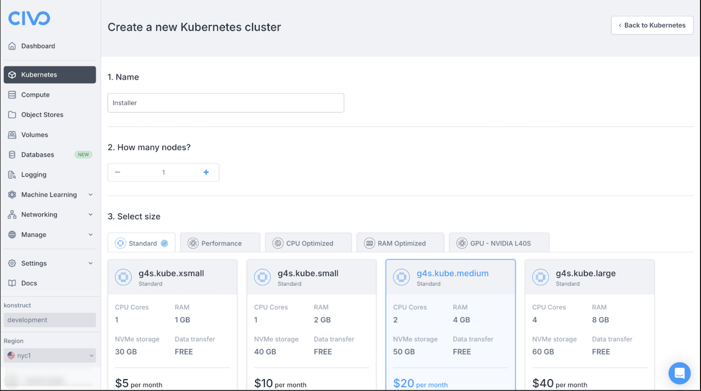
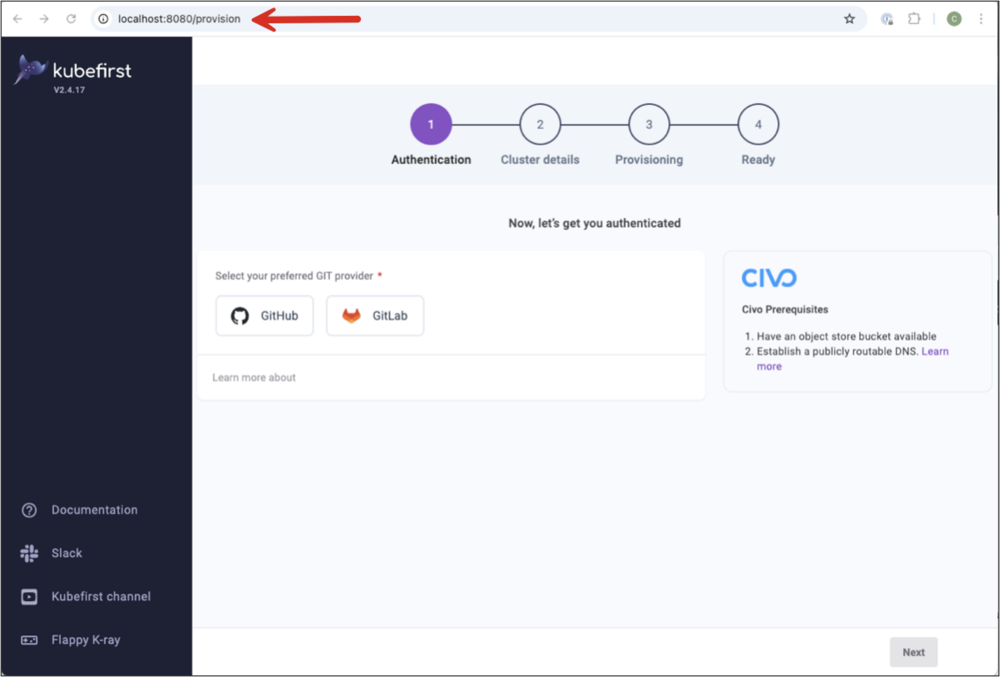
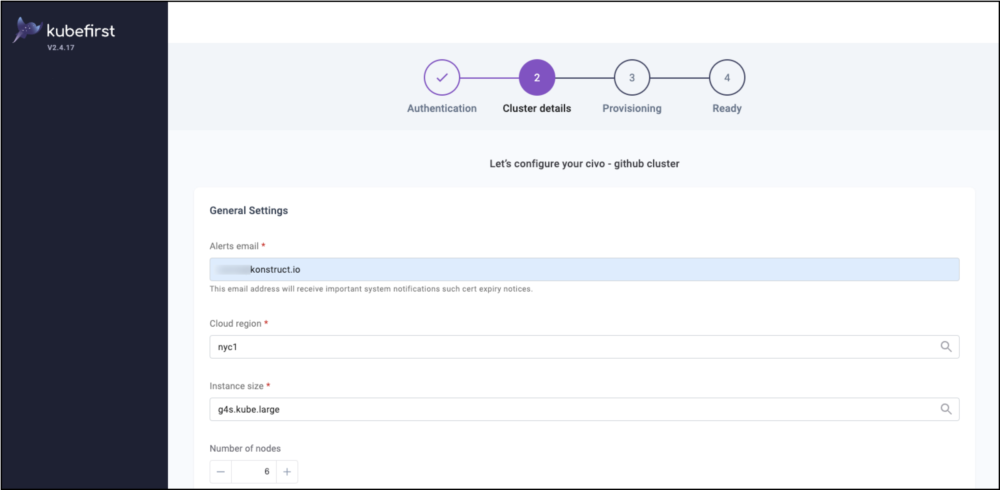
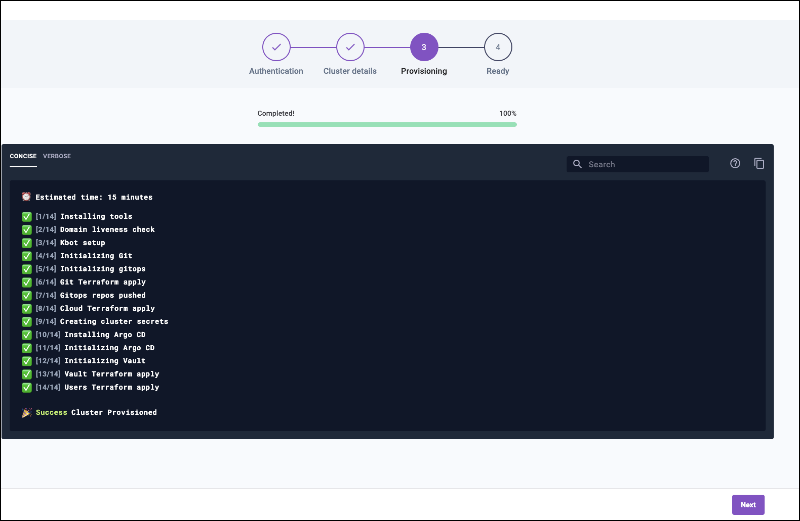
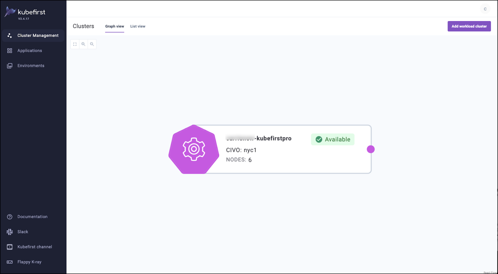

## Summary

After reviewing and confirming you have all of the prerequisites required for this installation process this page walks through all of the steps in both the Civo Dashboard and the terminal to complete the installation of **Kubefirst with Civo Marketplace and the Kubefirst UI**.

## Installing Kubefirst

These steps take place in the Civo Dashboard and in a terminal. To get started with this installation log in to the Civo Dashboard with your admin credentials. If you’re new to Civo visit their documentation for information on [signing up for the first time.](https://www.civo.com/docs/account/signing-up)

### Create your installer cluster

1. Log into your Civo account, navigate to Kubernetes, and select **Create New Cluster**.
2. Complete the basic cluster details as follows:
    Name: Installer
    Reduce the node count to 1
    Increase the node size to Medium
    Network, Firewall, and Advanced options can all remain set with defaults.
3. Scroll down the page to view the Marketplace section and select Kubefirst. (This should appear on the _Featured_ tab.)
4. Select **Create cluster** to launch the process to create your installer cluster.

    

Once the install begins it will launch the cluster information page to display the build process and status. _This process should only take a few minutes!_

### Connect to your installer cluster

:::info
In some cases you may get a certificate error or warning about an unsafe website for the Kubefirst UI. It’s okay to ignore this warning and open the URL.
:::

1. From the terminal run the following commands. _(Note: These commands assume you named the cluster installer)._

    ```bash
    civo kubernetes config installer --save
    kubectl --namespace kubefirst port-forward svc/kubefirst-console 8080:8080
    ```

2. Open the provisioning path `http://localhost:8080/` in your browser.

    

### Create your Kubefirst management cluster

The steps below provide the details you need to create your Kubefirst management cluster from the provisioning URL `(http://localhost:8080/provision)`

1. From the localhost path you established in the previous step select your preferred Git provider. (_We’re using GitHub for this example._)

    ![Open the Kubefirst UI][(../../../img/civo/authentication.png)

2. Provide the required details for your Git provider.
   - Personal Access Token/username
   - Organization name (Group for GitLab)
   - Civo API Key
3. Select **Next** for Cluster details. _Note: the recommendations below are a minimum requirement for size for your management cluster to run._
   - Alerts email - receives notifications for encryption certificate expiration. This email will not be used by Konstruct for anything outside of these notifications.
   - Cloud region - fra1 (_recommended_)
   - Instance size - g4s.kube.large (_recommended_)
   - Number of nodes - 4 (_recommended_)
   - DNS provider - Selecting Civo will update the details automatically. For Cloudflare provide the Cloudflare token, cluster domain name, subdomain name (optional), and cluster name.

    

4. **Advanced Options** are all optional and allow you to:
   - Override the gitops-template repository
   - Specify a different GitOps template branch
   - Use HTTPs instead of SSH
   - Prevent the installation of the Kubefirst UI component
5. Select **Create Cluster** once you’re satisfied with the details you’ve provided to start provisioning!
   - _This process is typically about 15-20 minutes._
6. When your cluster has successfully provisioned select **Next**.

    

7. After successful provisioning the cluster details with the new Vault password are provided in the next screen.

    

8. Select **Open kubefirst console** to see your cluster details.
   - The default username for your new cluster is `kbot`
   - **Save this password somewhere safe** to retain access to your management cluster.

    

Congratulations you have a brand new management cluster. 🎉

## What's Next?

After completing the installation we recommend that you deprovision the install cluster.

### Deprovision your install cluster

After you’ve completed your Kubernetes Pro installation there are three pieces of infrastructure you should remove: the install cluster, the network, and a storage bucket.

All three of these can be removed through the Civo Dashboard. Removing the installer cluster prevents you from incurring any unwanted costs for infrastructure that is no longer needed.

:::tip

Refer to the [full deprovisioning instructions for additional details.](../deprovision.mdx)

:::

### Explore Kubefirst

By default your new management cluster has been created in the Free tier of the Kubefirst Platform. This tier includes access to the Kubefirst Pro UI.

Now that you have a functional install you may want to:

- Explore more details on [Kubefirst Features](../../../features/)
- Read details on how to upgrade or manage users and passwords in [Kubefirst Administration](../../../admin/)
- Reach out to [us on Slack](https://konstructio.slack.com) to chat or ask questions
