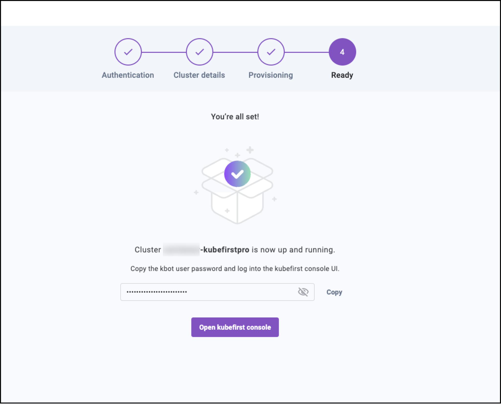

## Summary

After reviewing and confirming you have all of the prerequisites required for this installation process this page walks through all of the steps for **Kubefirst installation with DigitalOcean and the Kubefirst UI**.

## Kubefirst Install - New Cluster

:::tip

Refer to these initial steps if you **do not** have an existing cluster to start.

:::

### Step 1a - Install the Platform Installer Tools

Run the following command to launch the Kubefirst installer. This enables us to create your new management cluster using your preferred git provider.

    ```bash
    kubefirst launch up
    ```

### Step 2a - Connect to Kubefirst provisioning tool

When `kubefirst launch up` completes, it launches a browser displaying the Kubefirst installer at -  `http://console.kubefirst.dev`

 _Continue to Step 3._

## Kubefirst Install - Exiting Clusters

:::tip

Refer to these initial steps if you **have an existing cluster** to start.

:::

### Step 1b - Install the Platform Installer Tools

Run the following commands to add the Kubefirst installer tools to your existing cluster. This enables us to create your new management cluster in Google Cloud using your preferred git provider.

    ```bash
    helm repo add konstruct https://charts.konstruct.io
    helm repo update

    helm install kubefirst --namespace kubefirst --create-namespace  konstruct/kubefirst

    kubectl -n kubefirst port-forward svc/kubefirst-console 8080:8080
    ```

### Step 2b - Connect to Kubefirst installer

Open a browser to launch the Kubefirst installer with the URL -  `http://localhost:8080`

_Continue to Step 3._

## Kubefirst Install - Create your management cluster and launch

### Step 3 - Create your management cluster

1. From the path in the previous step select your preferred Git provider. (_We’re using GitHub for this example._)

2. Provide the required details for your Git provider.

    - Personal Access Token/GitHub username
    - Organization name (Group for GitLab)
    - DigitalOcean connection details

3. Select **Next** for Cluster details.
Note: the recommendations below are the minimum requirements to run a management cluster.

   - Alerts email - receives notifications for encryption certificate expiration. This email will not be used by Konstruct for anything outside of these notifications
   - Cloud region
   - Cloud zone
   - Instance size - e2-medium (recommended)
   - Number of nodes - 3 (recommended)
   - DNS provider - For Cloudflare provide the Cloudflare token, cluster domain name, subdomain name (optional), and cluster name
   - Hosted zone name - For GitHub this is your domain
   - Cluster name - management (or something similar)
  
4. In **Advanced Options**
   - Before you create your cluster, in the advanced settings drop down and you must specify the `gitops template branch` as `main`
  
5. For all other **Advanced Options** these are optional and allow you to:

   - Override the gitops-template repository
   - Use HTTPs instead of SSH
   - Prevent the installation of the Kubefirst Pro UI component

6. Select **Create Cluster** once you’re satisfied with the details you’ve provided to start provisioning! _This process is typically about 15-20 minutes._

7. When your cluster has successfully provisioned select **Next.**

8. After successful provisioning the cluster details with the new Vault password are provided in the next screen.

:::tip
This part of the provisioning process creates your management cluster, bootstraps your new platform onto that cluster, and then adds the Kubefirst UI to that platform. Kubefirst Pro includes a management cluster for free. You can upgrade your license to manage additional clusters.
:::

### Step 4 - Launch the Kubefirst UI

From the success screen you can now launch the Kubefirst Pro UI

    

1. Select **Open kubefirst console** to see your cluster details.
   - The default username for your new platform bot administrator account is `kbot`
   - **Save this password somewhere safe** to retain access to your management cluster.

Congratulations you have a brand new management cluster. 🎉

## What's Next?

After completing the installation we recommend that you deprovision the install cluster.

### Remove the Kubefirst installer

After you’ve completed your Kubefirst installation you can run the following commands to remove the installer from your cluster.

     ```bash
     
     kubefirst launch down
     
     ```

### Explore Kubefirst

By default your new management cluster has been created in the Free tier of the Kubefirst Platform. This tier includes access to the Kubefirst Pro UI.

Now that you have a functional install you may want to:

- Explore more details on [Kubefirst Features](../../../features/)
- Read details on how to upgrade or manage users and passwords in [Kubefirst Administration](../../../admin/)
- Reach out to [us on Slack](https://konstructio.slack.com) to chat or ask questions
