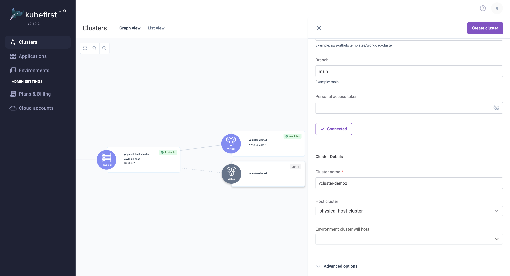
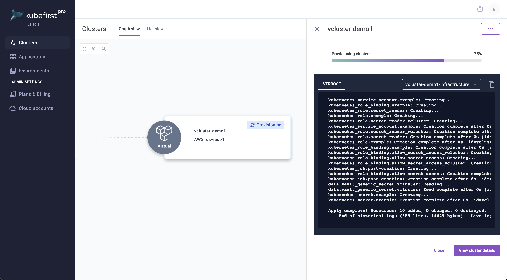
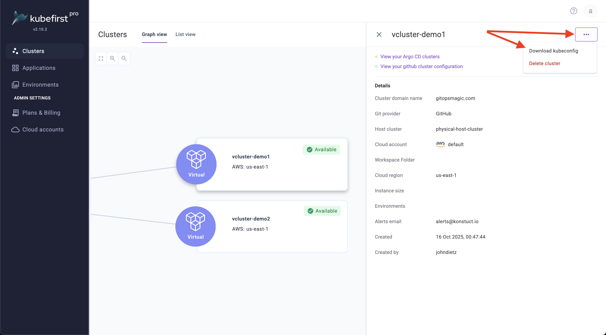
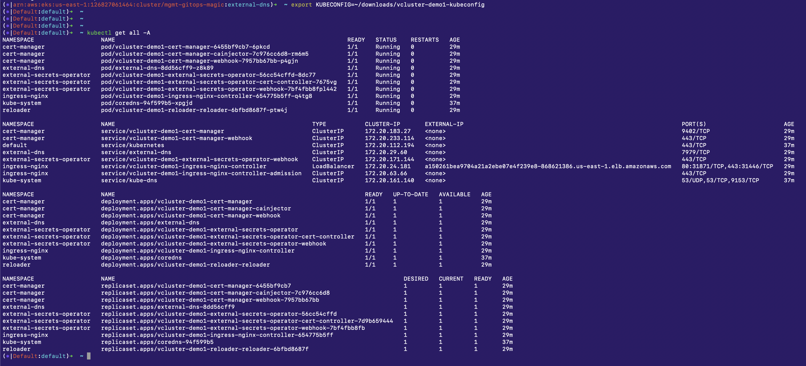

## Summary

Starting in Kubefirst Pro 2.10, you can host virtual clusters inside of any physical cluster. This allows you to isolate cluster resources without duplicating the cloud costs of another cloud Kubernetes cluster.

## Prerequisites

See [Custom Cluster Templates Prerequisites](./custom-templates-prereq.md).

## Using Virtual Clusters

### Create a host cluster

To create virtual clusters, you must first establish a new physical cluster in your cloud to serve as their host. The (./index.md)[clusters] page can walk you through that process, but in short you will navigate to clusters, create a new cluster, selecting your details for its size and placement, and await its availability, which you can monitor in your Argo CD instance.

For this documentation, we'll name this cluster `physical-host-cluster`.

### Add a virtual cluster to your host cluster

Once your host cluster is available, click Add Workload Cluster to begin the creation of another Kubernetes cluster.

Select cluster type `Virtual`

Select `Custom template`

- Git repository: `https://github.com/konstructio/gitops-template` 
- Path to template: `aws-github/templates/workload-host-vcluster`
- Branch: `main`

Connect to the new cluster template. You also can point this to your own GitOps repository if you want to customize the template.

Name your cluster `vcluster-demo1`

Choose your physical cluster from the previous step, our example named it `physical-host-cluster`

Click `Create Cluster`



### Real time crossplane provisioning logs

While the cluster is provisioning, once the infrastructure and bootstrapping processes begin, you'll be able to view the crossplane execution logs in real time as you await your new virtual cluster's availability.



Just like your physical cluster, you can monitor your provisioning and bootstrapping in your Argo CD instance where all of your virtual cluster applications will be managed as well. Once your cluster is fully available you can continue to connecting to your new virtual cluster.

### Connect to your virtual cluster

On your Clusters page in Kubefirst Pro, click on your available virtual cluster, click the ellipsis (...) and select Download kubeconfig, which will download this file to your browser's favorite downloads directory.



In a new terminal set your kubeconfig to that downloaded file, like this example. Update to match your downloaded file location.

```bash
export KUBECONFIG=~/downloads/vcluster-demo1-kubeconfig
```

In this same terminal, you can now run kubectl commands against your new isolated vcluster. For example `kubectl get all -A`.


