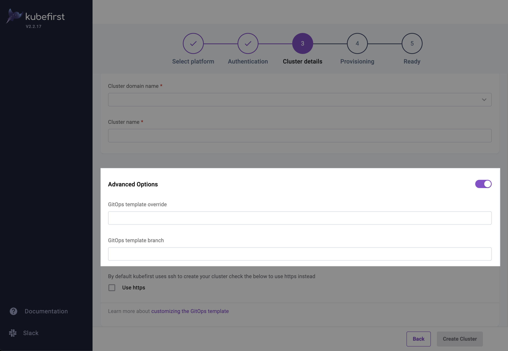
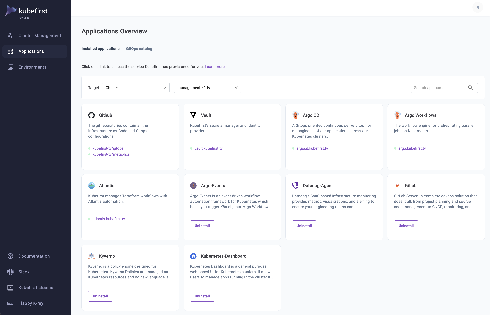
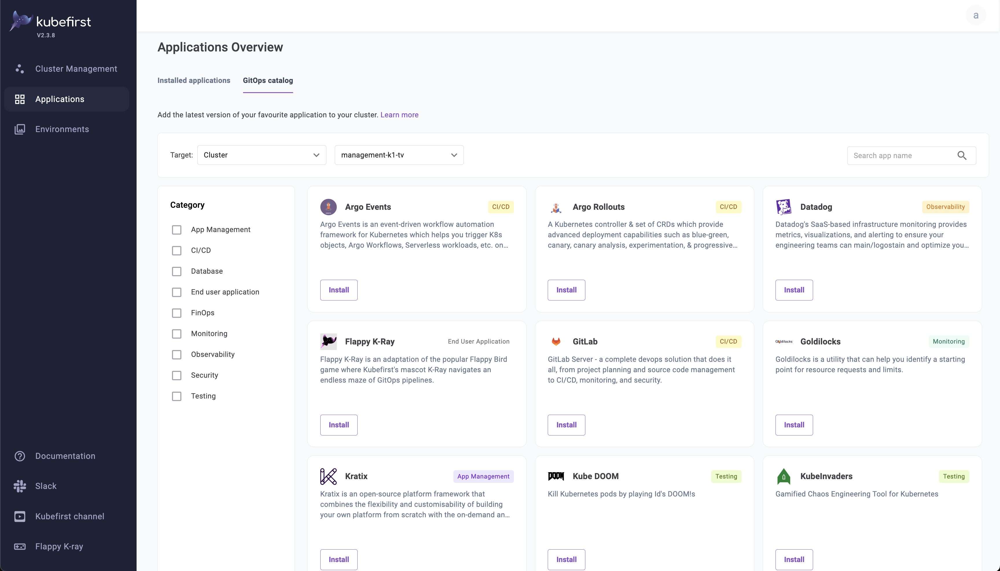

## Summary

Kubefirst is designed to include all of the tools you need to run a scalable GitOps platform powered by Argo CD GitOps. Defining your desired state using Git has enormous benefits including:

- An audit log of every system change including who made and who approved the change
- A secure main branch of the GitOps repository for easy security and approval controls for system changes
- Easy to understand rollbacks (revert the commit that caused the problem to the previous version)
- The declarative state significantly reduces the complexity of disaster recovery
- Creating new environments is as straight-forward as duplicating directory structures
- Having everything declared in the GitOps repository means everyone can agree to the source of truth for every version of every application


## How does Kubefirst use GitOps?

### Continuous Integration Pipeline

The Kubefirst Continuous Integration (CI) pipeline is stored in your privately hosted git repository. The trigger mechanism is either GitHub Actions or GitLab CI with a workflow submitted to Argo Workflows.

- The Argo Workflows publish your container with a pre-release Helm chart.
- The pipelines continue with promotion of the release through the `preprod` environments.
- Once the release is ready, the release chart is published and delivered to production, and the application chart's version is prepared for the next release.

The integration that we've established between the self-hosted git runners and Argo Workflows surfaces the powerful Argo Workflows engine directly in GitHub Actions or GitLab CI. This provides your developers with all of the workflow execution information available, directly associated with their commits in their application repository.


### GitOps Resources

Our registry includes GitOps patterns for numerous source types including:

- Helm Charts
- Wrapper Charts
- Kustomize Overlays
- Kubernetes Manifest Files

Kubefirst also includes an [example application - Metaphor](../features/metaphor/), that shows how easy it is to set up different configuration overrides for your environments.
To see what it takes to make the development instance of Metaphor different than the others, visit the `gitops` repository and navigate to `/components/development/metaphor/values.yaml`

Any Helm value that should deviate from the default chart can be set here so your environment overrides are always concise and clear.

## Using Your Own `gitops-template` Repository Fork

If you want to customize the template before creating a new cluster, you can fork the [`gitops-template` repository](https://github.com/kubefirst/gitops-template), and use it as the source for cluster creation. We recommend following the [forking instructions from GitHub](https://docs.github.com/en/get-started/quickstart/fork-a-repo).

Note that the tags won't follow, and they may be needed in order for the CLI to properly function.

[Clone your new repository](https://docs.github.com/en/repositories/creating-and-managing-repositories/cloning-a-repository) locally, and once inside the repository folder, run the following commands in your terminal to update your repository with the tags:

```shell
# If you give another name to your gitops-template repository, this will need to be updated.
git remote add upstream git@github.com:kubefirst/gitops-template.git
git fetch upstream
git push --tags
```

Now you can use the `--gitops-template-url` flag pointing to your new repository when creating a new Kubernetes cluster.

When the Kubefirst CLI checks out the `gitops-template-url` flag for the repository URL, it defaults to checking out the git tag that matches the CLI's version. For example a v2.0.0 CLI would check out the `gitops-template-url` at the tag `v2.0.0`.

- This is not always the desired effect, as you may be forking in order to introduce changes to the `gitops-template` repository structure. In order to checkout the `main` branch of your forked `gitops-template` repository include the `--gitops-template-branch main` flag (instead of the version tag) with the `create` command.
- You can also find the equivalent of these flags in the `Advanced Options` section of the `Cluster details` step if you are using the UI installer.



## GitOps Catalog

After your Kubefirst cluster has been provisioned you have the option to take advantage of the Kubefirst UI and the Kubefirst GitOps Catalog. The GitOps Catalog is a community-driven collection of Kubernetes applications that can be deployed directly to your Kubefirst cluster(s).

For more information about available applications, check out the [GitOps Catalog repository](https://github.com/kubefirst/gitops-catalog).

### Using the Catalog

After your management cluster has been provisioned and you have access to the Kubefirst UI (Kubefirst Pro).

1. In the Kubefirst UI, navigate to the Applications page to explore the applications that have been provisioned to your cluster under **Installed Applications**.

    

2. Select the **GitOps catalog** option to show the catalog:

    

3. From the GitOps catalog page select **Install** on any of the available applications to deploy to a specified cluster or cluster template.

    - When you install any of the available services from the GitOps Catalog, the Kubefirst API formats and commits a set of files to your `gitops` repository.
    - Then, Argo CD is asked to refresh the upstream registry to synchronize the newly deployed application.
    - The deployment of these applications is done directly in your `gitops` repository, and provides you with full ownership to customize these applications by adjusting their content within your `gitops` repository.

    For example - consider the following sample deployment of Kubernetes Dashboard:

    ```yaml
    ---
    apiVersion: argoproj.io/v1alpha1
    kind: Application
    metadata:
    name: management-kubernetes-dashboard
    namespace: argocd
    spec:
    project: default
    source:
        repoURL: 'https://kubernetes.github.io/dashboard'
        targetRevision: 6.0.0
        chart: kubernetes-dashboard
    destination:
        name: management
        namespace: kubernetes-dashboard
    syncPolicy:
        automated:
        prune: true
        selfHeal: true
        syncOptions:
        - CreateNamespace=true
    ---
    kind: ClusterRoleBinding
    apiVersion: rbac.authorization.k8s.io/v1
    metadata:
    name: k8s-dashboard-clusterrole
    annotations:
        argocd.argoproj.io/sync-wave: "0"
    subjects:
    - kind: ServiceAccount
        name: management-kubernetes-dashboard
        namespace: kubernetes-dashboard
    roleRef:
    kind: ClusterRole
    name: admin
    apiGroup: rbac.authorization.k8s.io
    ---
    apiVersion: v1
    kind: Secret
    metadata:
    name: dashboard-user
    namespace: kubernetes-dashboard
    annotations:
        kubernetes.io/service-account.name: management-kubernetes-dashboard
    type: kubernetes.io/service-account-token
    ```

4. If you'd like to make changes to any of the Helm chart values, change the Helm chart version, or add any additional resources, edit this file in the `main` branch and Argo CD will detect the changes from your upstream `gitops` repository and synchronizes these changes.

## Getting Help

We want to hear from you! If you have questions about navigating our GitOps approach we'd love to help, [reach out to us on Slack](https://konstructio.slack.com).

Our `#helping-hands` channel is monitored by our team to help address questions and troubleshoot any issues you have.
