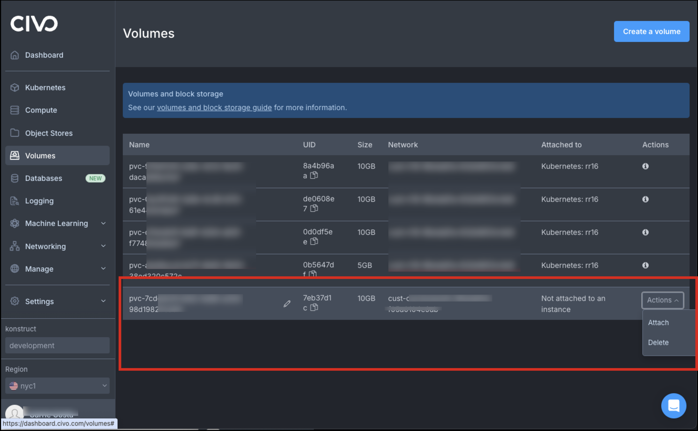

## Summary

For users who want to destroy the Kubefirst management cluster you will be able to complete the deprovisioning process with the steps outlined below. These steps take place from the command line and are specific to Civo.

These instructions only cover the process to **deprovision your management cluster**, not your installer cluster.

- We recommend deprovisioning the installer cluster from Kubefirst Pro before you deprovision your management cluster.
- If you have already deprovisioned the management cluster and no longer have access to the Kubefirst Pro UI, you can remove the installer cluster through the Civo Dashboard.

_Note: This process does not completely remove any local directories or associated files._

## Deprovisioning Scenarios

### Removing a test Kubefirst Pro install

I’m deprovisioning because I was just testing things out and want to get rid of all of the associated resources.

We’re sorry to see you go, but…  if this is your scenario, proceed with the instructions as written.

### Removing a management cluster as part of cleanup

I’m deprovisioning a management cluster as part of a cleanup for a production setup.

:::warning
If you are removing your management cluster as part of a general cleanup these instructions are a bit more extensive than what your scenario requires.

- Do NOT delete your workload clusters from Kubefirst Pro
- Do NOT delete your repositories or GitOps details (anything from step 3 onward).

:::

## Prerequisites

Before deprovisioning there are several things you will need to have set up to successfully complete the process. Each of those items, including the commands to install, are identified below.  

_Note: The commands below assume [you are using Homebrew.](https://brew.sh/)_

### Kubefirst CLI

For users that did not install or operate from the command line, you will need to install the Kubefirst CLI.

Run the following command to install `brew install kubefirst/tools/kubefirst`

- Review additional details about [installing the Kubefirst CLI.](https://docs.kubefirst.io/next/aws/quick-start/install/cli/#local-prerequisites)

### Kubectl

Run the following command to install Kubectl `brew install kubernetes-cli`

- Review additional details [about the Kubernetes CLI.](https://kubernetes.io/docs/tasks/tools/#kubectl)

### Civo CLI

Run the following commands to install the Civo CLI

    ```bash
    brew tap civo/tools
    brew install civo
    ```
Review additional details [about the Civo CLI.](https://www.civo.com/docs/overview/civo-cli)

### Terraform CLI

To complete the deprovisioning process, install the Terraform CLI. `brew install terraform`

- Review additional [details about Terraform.](https://developer.hashicorp.com/terraform/tutorials/aws-get-started/install-cli)

### Get your cluster details

Get your `kubeconfig` details for your cluster with the following command. Replace `my-cluster` with your cluster name.

    ```bash
    civo kubernetes config <my-cluster> --save
    ```

## Getting Support

Started the deprovisioning and ran into an issue? Have a question about the process and don’t see it mentioned here?

TL;DR we’ve got you covered. [Join our Slack Community](https://konstructio.slack.com/) for support and get the answers you need!

## Steps for Deprovisioning

### Step 1 - Retrieve and set your Vault token

This command assumes you've exported the environment variable KUBECONFIG=/path/to/my/kubeconfig - if not, you can add --kubeconfig /path/to/my/kubeconfig just after kubectl.

    ```bash
    export VAULT_TOKEN=$(kubectl -n vault get secrets/vault-unseal-secret --template='{{index .data "root-token"}}' | base64 -d)
    ```
If you have not exported your KUBECONFIG environment variable run the following:

    ```bash 
    export VAULT_TOKEN=$(kubectl -n vault get secrets/vault-unseal-secret --template='{{index .data "root-token"}}' | base64 -d)
    ```

### Step 2 - Retrieve your environment variables

To complete deprovisioning you will need to retrieve your environment variables.
This first command collects your secrets from the ATLANTIS key in Vault and
outputs them to a file referenced by the --output-file flag. It
needs the YOUR_DOMAIN portion to be replaced with your domain. The
second command sets the environment variable values in the current terminal context.

    ```bash
    kubefirst terraform set-env \
    --vault-token $VAULT_TOKEN \
    --vault-url https://vault.YOUR_DOMAIN \
    --output-file .env

    source .env
    ```
:::warning
If Vault wasn't correctly deployed and initiated when you created your cluster, this step won't generate a proper .env file.
This does not mean that the cluster or other resources weren't created properly. To complete deprovisioning you will need to do one of the following:

- Set some environment variables manually (see the tip at the Cloud Provider step to see all values needed)
- Provide the specific values to Terraform when prompted

:::

:::danger[Stop here]
Stop here if you have provisioned infrastructure in addition to the management cluster created by the Kubefirst installation.
:::

### Step 3 - Clone your GitOps repository

**Warning**: Do not complete this step if you have provisioned infrastructure in addition to the management cluster created by the Kubefirst installation.

**Some notes on cloning your GitOps repository:**

- This step requires access to your GitHub or GitLab token (_this is typically the same token you used to create your initial management cluster_)
- Update the command to reflect the organization (`my-org`) you specified as part of the initial cluster creation

#### Clone using HTTPS

For HTTPS run the following command for GitHub

`git clone https://github.com/<my-org>/gitops.git`

For HTTPS run the following command for GitLab

`git clone https://gitlab.com/<my-group>/gitops.git`

#### Clone using SSH

For SSH run the following command for GitHub

`git clone git@github.com:<my-org>/gitops.git`

For SSH run the following command for GitLab

`git clone git@gitlab.com:<my-group>/gitops.git`

### Step 4 - Run Terraform to destroy your cluster

**Warning**: Do not complete this step if you have provisioned infrastructure in addition to the management cluster created by the Kubefirst installation.

:::danger[Danger]
If you have added custom resources to the Terraform section of your GitOps repository, these resources are included in the plan. Exercise extreme caution when destroying, and review Terraform’s official documentation before proceeding.
:::

1. Switch to the Terraform directory inside of the cloned GitOps repository.
   `For example: cd gitops/terraform`
2. Locate the subdirectory for Civo that contains the infrastructure-as-code declarations for your Kubefirst resources.
    `For example: cd civo`
3. Once you have confirmed that you are appropriate directory you can use the standard Terraform commands:
      - `terraform init`
      - `terraform destroy`

#### Notes on Terraform destroy

_If the init command is not working, it's probably related to the .env file not being sourced or created properly._

- To validate that it was sourced correctly run `echo $TF_VAR_kbot_ssh_private_key` which should return a value.
- If you close your terminal or reload your ZSH or Bash configuration files, the values will be lost: you will need to source the .env file again.
- You can also validate that the file contains the required environment variables, and should have items including: AWS_ACCESS_KEY_ID, VAULT_TOKEN, and VAULT_ADDR, etc.

### Step 5 - Removing remaining assets from Civo

**Warning**: Do not complete this step if you have provisioned infrastructure in addition to the management cluster created by the Kubefirst installation.

_For Civo, the current configuration prevents the removal of all of the assets created as part of provisioning your management cluster._

Important: To complete the deprovisioning you will have to log in to the Civo dashboard and manually remove the volumes associated with your cluster.  These can take several minutes to appear. The only assets that you have to manually remove from the dashboard are the volumes.

1. Navigate to your Civo Dashboard and open **Volumes**.
2. Locate the **volumes** associated with your Cluster.
   - You can identify these by their “attached to” status, which should be listed as “Not attached to an instance”
   - You should also only have access to the **Action**s menu for volumes that you created.

    

3. Once you’ve successfully deleted the remaining volumes run `terraform destroy` to remove the remaining resources.

### Step 6 - Removing other assets

Installing Kubefirst creates folders and assets in a handful of places that deprovisioning doesn’t specifically address.

To completely remove all of the local assets you will need to verify that your Docker installation has no remaining containers or volumes associated with Kubefirst.

You can also verify that you remove any files or folders from your local machine including the ~/.k1 folder, the ~/.kubefirst file.

## Step 7 - Reset (optional)

Running `kubefirst reset` cleans local files generated by the installer. It leaves logs file, and the SSL certificates untouched. This command will not destroy your cluster (cloud resources or k3d), and is not a replacement for the `kubefirst destroy` command.

:::tip
Going through these extra steps also ensures that any future Kubefirst or Kubefirst Pro installations don’t fail when they encounter assets from former installations.
:::

🎉 Success - You have successfully deprovisioned your Kubefirst installation.
