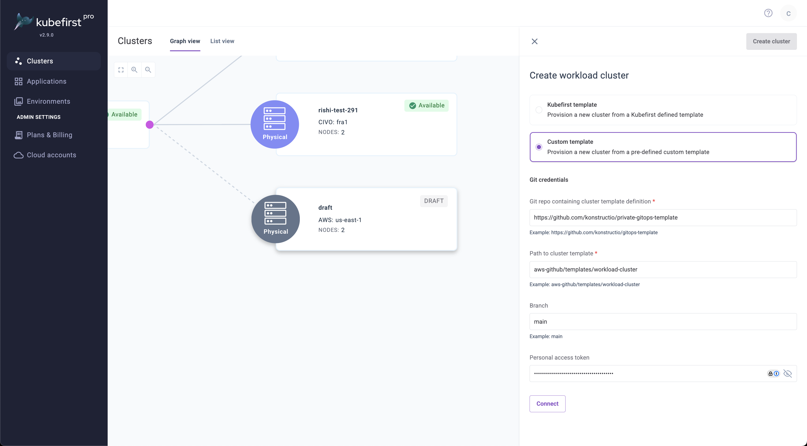

## Summary

Starting in Kubefirst Pro 2.9, you can bring your own workload cluster templates and specify custom Terraform modules for cluster infrastructure creation. This feature enables you to define custom input variables that dynamically prompt users during cluster creation.

## Prerequisites

See [Custom Cluster Templates Prerequisites](./custom-templates-prereq.md).

## Using Custom Templates

### Create a Custom Template

A workload cluster template is a directory in a git repository that has GitOps content used when creating a workload cluster. The template allows you to use `<TOKENS>` to be used as variables for replacement during cluster provisioning. Kubefirst comes with many available tokens automatically, but allows you to add your own tokens as well.

### Define Input Variables

1. In your template root directory, create a `kubefirst.yaml` file.
2. Define the cluster type and input variables:
   ```yaml
   clusterType: "physical" # physical|virtual|gpu
   inputs:
     - name: "cidr"
       token: "<WORKLOAD_CIDR>" 
       prompt: "Enter your workload cluster VPC CIDR block"
       tip: "10.0.0.0/16"
     - name: "business-unit"
       token: "<BUSINESS_UNIT>"
       prompt: "Enter your business unit name"
       tip: "e.g. 'engineering', 'sales', 'marketing'"
   ```
3. Use the tokens directly in your GitOps yaml content wherever values should be replaced per instance.
4. Commit and push the new `kubefirst.yaml` file to your git repository.

### Create a Cluster with your Custom Template

#### Connect to your cluster template



1. Select **Create Cluster**.
2. Choose **Custom Template** from the template dropdown.
3. Provide the URL for your custom template's git repository
4. Specify the path in that git repository where the workload cluster template folder resides
5. Enter the branch or tag name to define the version of your template
6. Provide a PAT if your git repository is private
7. Click Connect

#### Complete your cluster creation details

1. Complete standard cluster options (name, region, nodes).
2. Complete the custom prompted variables:
   - Each input defined in `kubefirst.yaml` will appear as a form field
   - The prompt text guides the user on what the field is
   - Tips provide example values
3. Select **Create Cluster**.

The resulting yaml that gets committed to your `gitops` repository will have your tokens replaced with the values that were provided by the end user. These values will also be available on your cluster details view.

## Workload Cluster Template Requirements

Your custom workload cluster template must follow these conventions:

### Directory Structure

The `kubefirst.yaml` file is required in the cluster template's top folder.

```
your-template-repo/any-template-folder/
├── kubefirst.yaml
├── argocd-application-1.yaml
├── argocd-application-2.yaml
└── argocd-application-1/
    ├── application.yaml
    └── external-secret.yaml
└── argocd-application-2/
    ├── application.yaml
    └── external-secret.yaml
└── terraform/
    ├── main.tf
    ├── eks/
    └── vpc/
```

Here is an example Argo CD application with a custom token

```yaml
apiVersion: argoproj.io/v1alpha1
kind: Application
metadata:
  annotations:
    argocd.argoproj.io/sync-wave: "10"
  name: kubefirst
  namespace: argocd
spec:
  destination:
    name: in-cluster
    namespace: kubefirst
  project: default
  source:
    chart: kubefirst-pro
    repoURL: https://charts.konstruct.io
    targetRevision: "<MY_CUSTOM_VERSION_TOKEN>"
  syncPolicy:
    automated:
      prune: true
      selfHeal: true
    syncOptions:
    - CreateNamespace=true
```

### Leveraging Tokens in your Cluster Terraform Module

Your terraform code in your cluster module will use terraform variables just like you always would.

```hcl
# variables.tf example
variable "vpc_cidr" {
  description = "VPC CIDR block"
}

variable "business_unit" {
  description = "Business unit for tagging"
}
```

In order to provide input values to these terraform variables, specify your tokens in your workspace as shown here

```yaml
apiVersion: tf.upbound.io/v1beta1
kind: Workspace
metadata:
  name: <WORKLOAD_CLUSTER_NAME>-infrastructure-bootstrap
spec:
  providerConfigRef: 
    name: <WORKLOAD_CLUSTER_NAME>
  forProvider:
    source: Remote
    module: git::https://github.com/kubefirst/gitops-template.git//aws-github/terraform/aws/modules/bootstrap?ref=main
    vars:
    - key: cluster_name
      value: "<WORKLOAD_CLUSTER_NAME>"
    - key: vpc_cidr
      value: "<WORKLOAD_CIDR>"
```

This example shows the use of native kubefirst token `<WORKLOAD_CLUSTER_NAME>` as well as a custom token `<WORKLOAD_CIDR>`.
These values will be replaced by the system and user inputs.

### Advanced options

As shown in the example above, it's most common to simply use the module that is specified in your Workspace. If you want to override
the default module that your workload cluster template uses however, simply expand the Advanced options, and specify the 
location of the repository and the path to the module.